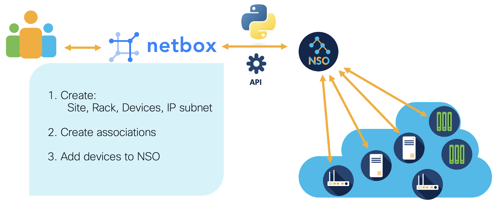
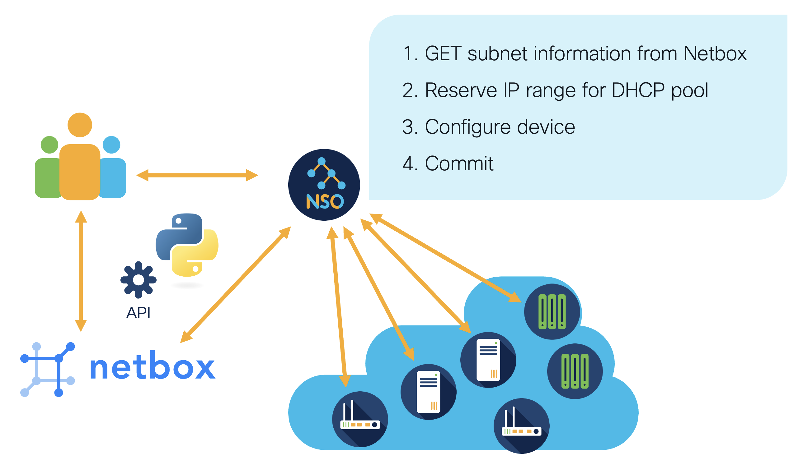
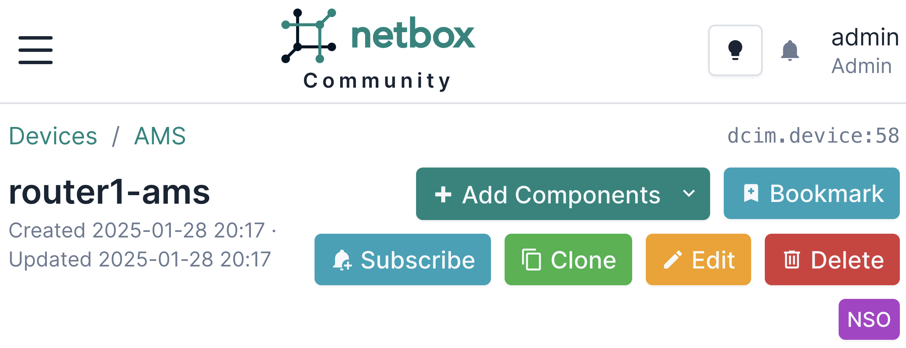

<p align="center">
    <h1 align="center" style="font-size: 48px; font-weight: bold;">DEVNET-1506<br></h1>
        <h3 align="center" style="font-size: 32px; font-weight: bold;">Stop the Chaos, Organize Your Network with NSO and Netbox</h3>
        <p align="center" style="font-size: 14px;">Cisco Live 2025 Amsterdam</p>
</p>


## Table of contents

- [Introduction](#introduction)
- [Netbox](#netbox-rest-api)
- [NSO](#nso-restconf-api)
- [Integration Examples](#integration-examples)
- [Resources](#resources)


## Introduction
Using Cisco Network Services Orchestrator (NSO) and NetBox as a source of truth can be a powerful combination for network automation and management. 

NSO is a multi-vendor network automation platform that provides a framework for defining network services and automating their deployment across a wide range of multi vendor devices. It supports various network devices and technologies, enabling consistent and automated service delivery.

NetBox is an open-source IP address management (IPAM) and data center infrastructure management (DCIM) tool. It serves as a source of truth for network assets, IP space, and connections. It provides a single pane of glass for managing and documenting network infrastructure, offering features like IP address management, device inventory, circuit tracking, etc.

NSO can use data from NetBox to orchestrate network services, ensuring they align with the documented network architecture and policies. NetBox's RESTful API allows NSO to query and update network data programmatically. This integration facilitates automated workflows and ensures that network changes are reflected in both systems.


## Netbox REST API

Documentation for Netbox REST API endpoints can be accessed on a NetBox instance at /api/docs/. API can be also browsed directly through a web browser by visiting its root at /api/.

***Retrieve a list of devices from NetBox with curl***
```
curl -X GET \
-H "Authorization: Token your_api_token_here" \
-H "Content-Type: application/json" \
-H "Accept: application/json" \
http://netbox.lab/api/dcim/devices/
```

***Retrieve a list of devices from NetBox with python***

```
import requests

url = "http://netbox.lab/api/dcim/devices/"
token = "your_api_token"

headers = {
    "Authorization": f"Token {token}",
    "Content-Type": "application/json",
    "Accept": "application/json",
}

response = requests.get(url, headers=headers)

if response.status_code == 200:
    devices = response.json()
    print("Devices retrieved successfully:")
    for device in devices['results']:
        print(f"ID: {device['id']}, Name: {device['name']}")
else:
    print(f"Failed to retrieve devices: {response.status_code} - {response.text}")
```

> [!NOTE]  
Remember to replace placeholders with your actual server URL and API token, and ensure your NetBox instance is accessible from where you're running the script. <br><br> Install the Requests Library: If you haven't already, you can install it using pip.pip install requests


## NSO RESTCONF API

RESTCONF is an HTTP-based protocol that provides a standardized way for web applications to interact with networking devices, allowing access to configuration data, state information, data-model-specific Remote Procedure Calls (RPCs), and event notifications.

Configuration and state data resources can be fetched using the GET method and updated or changed using the DELETE, PATCH, POST, and PUT methods. The data is typically formatted in XML or JSON.

> [!NOTE]
To enable RESTCONF in NSO, it needs to be enabled in the ncs.conf configuration file. 

```
<restconf>
  <enabled>true</enabled>
</restconf>
```

Any HTTP client can be used, the following examples show interaction with curl and python.

***A RESTCONF request using curl***

```
curl -is -u admin:admin \
-H "Accept: application/yang-data+json" \
http://nso.lab:8080/restconf/data
```


***Same RESTCONF request using python:***
```
import requests

url = "http://nso.lab:8080/restconf/data"
headers = {"Accept": "application/yang-data+json"}
auth = ("admin", "admin")

response = requests.get(url, headers=headers, auth=auth)

print(response.status_code)
print(response.text)
```

## Integration Examples

Prerequisites
- **NSO** in docker (examples tested with v 6.4)
- **Netbox** in docker (examples tested with v 4.2.1)


> [!NOTE]  
In all the examples NSO and Netbox hostname/IP is represented as `nso.lab:8080` and `netbox.lab`.

### Netbox form
Let's image we have a process for opening company branches in new locations. 
We get new devices there, rack, install and connect them. After that we want to have them configured, provisioned in our systems, and be ready for use.

In this example we want to automate the setup and configuration of network devices and their management at the opening of a new office branch.

To upload and run Netbox script go to Netbox -> customization -> Scripts tab

#### Netbox script steps:
1. Creates a Netbox Form - collects input data in Netbox (site code, name, number of switches)
2. Creates new site
3. Selects next available IP prefix, reserves it for the site
4. DNS reservations for router and switches
5. Creates rack
6. Creates devices
7. Assigns IPs to interfaces
8. Adds devices to NSO and fetches their ssh host keys

After the objects are created we want to use that information to be used by NSO to apply configuration on the devices. 




The script uses Netbox built in data model in to interact with Netbox data model. The NSO communication part, is executed with RESTCONF API using python requests library. 

The code is available [here](scripts/netbox_form.py) 

### NSO python script 

To demonstrate exchange of information between NSO and Netbox initiated from NSO site, we will prepare python script, run from system, where NSO is running. This example will configure dhcp server on selected router. 

#### NSO script steps:
1. Gets the information about subnet of a site where router is located from Netbox
2. Reserves new pool in Netbox for DHCP pool
3. Prepares router DHCP server configuration
4. Pushes configuration to the device



The script uses python ncs package. The maagic module simplifies the way of accessing NSO data. It helps in navigating the data model, using standard Python object dot notation, giving clear and readable code. 
 The Netbox communication, is executed with REST API using python requests library. 

The code is available [here](scripts/nso-dhcp.py) 


### Netbox customizations

#### Custom field
Netbox allows customization of its objects with custom fields. 
An example of use would be to define a custom field specifying NSO NED and assigning it to device type. Custom fields can be edited at extras ->  custom-fields


#### Custom link 

You can create custom link redirecting to the device in NSO (NSO button):



To create custom link go to extras ->  custom-links and add new one.
Choose `DCIM > DEVICE` in object type field
Put link to your NSO in Link URL field, where you model name of the device in nso url
`http://nso.lab:8080/webui-one/ConfigurationEditor/config/none/widgets/ncs:devices/device%7B{{ object.name }}%7D`


## Summary
By leveraging NSO for orchestration and NetBox as a source of truth, organizations can achieve a highly automated and reliable network management environment. Changes in the network can be dynamically reflected across both platforms, maintaining alignment between operational reality and documentation.

Implementation Considerations
- Ensure that both NSO and NetBox are properly configured and that data models in NetBox align with the needs of NSO.
- Secure the API communication between NSO and NetBox, using authentication and encryption to protect sensitive data.
- Regularly audit the data in NetBox to ensure it remains an accurate source of truth.
- Depending on your network environment, you might need to customize the integration scripts or workflows to suit specific needs.


## Resources
- Try out NSO - [NSO on DevNet](https://developer.cisco.com/site/nso/)
- [NSO Documentation](https://developer.cisco.com/docs/nso/)
- Getting started with [NSO RESTCONF API](https://developer.cisco.com/docs/nso-guides-6.3/the-restconf-api/#getting-started)
- NSO Developer code share - [NSO on GitHub](https://github.com/NSO-developer/NSO-developer)
- [Single Source of Truth in Network Automation White Paper](https://www.cisco.com/c/en/us/solutions/collateral/executive-perspectives/technology-perspectives/ssot-nw-automation-wp.html)
- [Cisco Network Services Orchestrator (NSO): The Bridge to Automation](https://www.cisco.com/c/en/us/solutions/service-provider/solutions-cloud-providers/network-services-orchestrator-solutions/bridge-to-automation.html#~automation-matters)


